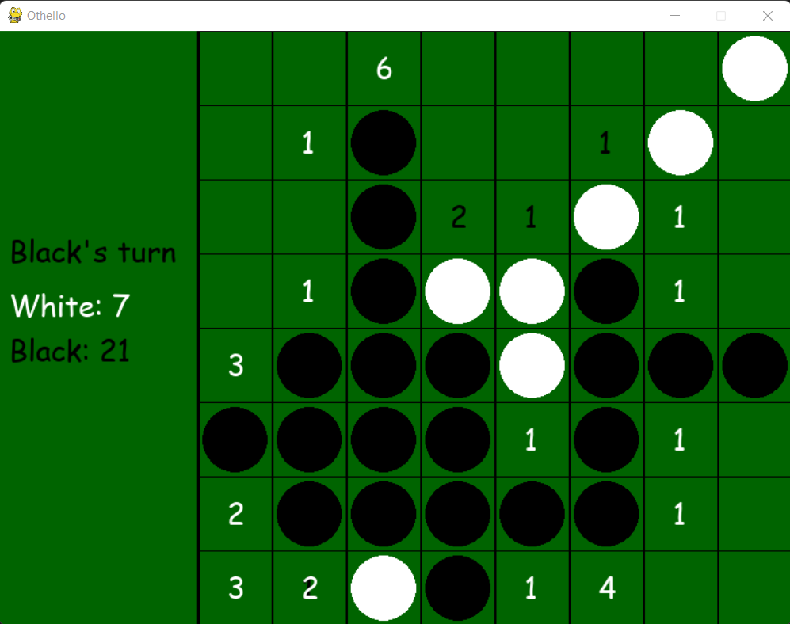

# othello-python

Desktop client for the game called Othello with built-in bots using AI methods for evaluating best moves in given positions. Project created for the Artifical Intelligence classes on Warsaw University of Technology.

Due to the purpose stated above, all documentation and program output is provided in Polish.

The project is provided as is and is no longer maintained. Author does not guarantee the correctness of the implementation nor the tests performed.

## Technology
Project is implemented using Python 3.10, with pygame for handling UI and game events and numpy for calculations.

## Purpose
Initial goal of the project was to understand and analyze an AI method called __Monte-Carlo Tree Search (MCTS)__. This is not a research project - all information and topics covered are already well-known as AI basics.

Implementation covers and compares four different approaches to solving the problem of finding an optimal move in given position:
* Simlpe heuristic algorithm - chosing the best reachable temporary state, based on hardcoded, empirically detemined weights for each field. Pawn is placed on the field with the highest weight among the available fields.
* Alpha-beta prunning - alpha-beta prunning with state evaluated as a sum of weights for all fields occupied by given player's pawns.
* Base MCTS algorithm - base Monte-Carlo Tree Search as known in literature.
* MCTS with UCB1-tuned - modification of base MCTS algorithm, using UCB1-tuned algorithm instead of UCT (non-constant value for algorithm's "curiosity")
* MCTS with states grouping - modification of base MCTS algorithm, where the game tree is replaced with the acyclic graph, whose nodes represent particular game state ignoring board orientiation and colors.

## Structure
Files are split into three directories:
* _docs_ - documentation (in Polish) - report, presentation of the results and LaTeX source code for the report
* _source_ - source code of the project, including main logic as well as the configuration files (in subdirectory _source/config_)
* _testresults_ - output files with test results

## Configuration and usage
In order to run the application, open the _main.py_ script using python. Game will start, configured according to the values in the file _config/config.json_.

| Parameter | Required | Description |
| --------- | -------- | ----------- |
| _game\_type_ | No | Type of the game - match for single game or tournament for set of games. Default: _match_. |
| _game\_repetitions_ | No | Number or repetitions of each game for different seeds each. Default: _1_. |
| _seed_ | No | Seed used to randomly generate next seeds for each game repetition. Default: _None (random is used)_. |
| _heurstic\_simulation\_depth_ | No | Number of levels used for alpha-beta simulation by heurstic player. Default: _10_. |
| _mcts\_simulation\_count_ | No | Number of simulations run for MCTS by all MCTS-based players. Default: _500_. |
| _show\_visualization_ | No | Indicates if visualisation of games should be opened. Ignored if any player is controlled by the user. Default: _true_.
| _output\_file_ | No | Path to output file which will be overwritten with games result. Default: _None (no output to file)_ |
| _players_ | Yes | List of participating players. Must contain at least 2 players. Each one configured with _player\_type_ (required) and _player\_color_ (optional), described below. |
| _player\_type_ | Yes | Type of the player - algorithm to use for bot or _user_ for player controlled by the user. Supported values: _user_, _simple\_heuristic_, _heuristic_, _random_, _mcts\_uct_, _mcts\_ucb1_, _mcts\_grouping_. |
| _player\_color_ | No | Color of player's pawns. Ignored for tournament mode or if not set for every player. |

Schema for the config file is included in the file _config/config-schema.json_.

### Usage

If a player is controlled by the user, moves are made by clicking with left mouse button on one of the fields. If placing a pawn on selected field is illegal (already taken or would not lead to any capture), the click is ignored. Information on which player is supposed to make a move is displayed in the pane on the left to the board.

For demonstration purposes, a number is displayed on each field of the board, indicating how many captures can be made by placing the pawn with given color on the given field. Information is not displayed on illegal fields.

## Sources
1. Marcin Maj. _"Reversi i othello to dwie różne gry. Poznajcie ich różne zasady."_ https://bonaludo.com/2016/01/29/reversi-i-othello-to-dwie-rozne-gry-poznajcie-ich-zasady/.
1. Cameron Browne et al. _"A Survey of Monte Carlo Tree Search Methods"_. doi: 10.1109/TCIAIG.2012.2186810.
1. Benjamin E. Childs, James H. Brodeur, and Levente Kocsis. _"Transpositions and move groups in Monte
Carlo tree search"_. doi: 10.1109/CIG.2008.5035667.10
